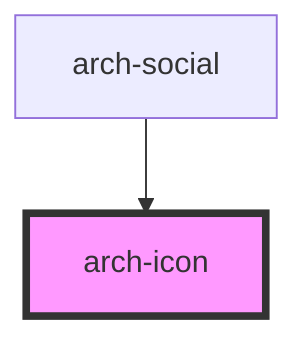

# arch-icon

<!-- Auto Generated Below -->

## Properties

| Property  | Attribute | Description                                                                                                                                                                                           | Type     | Default     |
| --------- | --------- | ----------------------------------------------------------------------------------------------------------------------------------------------------------------------------------------------------- | -------- | ----------- |
| `classes` | `classes` | The svg icon css classes 'svg-icon--selected' - Active class 'svg-icon--without-hover' - Icon without interaction 'svg-icon--without-fill' - Icon without add a fill color (keep original fill color) | `string` | `''`        |
| `svg`     | `svg`     | The svg icon name                                                                                                                                                                                     | `string` | `undefined` |

## Dependencies

### Used by

 - [arch-social](../social-network)

### Graph

----------------------------------------------

*Built with [StencilJS](https://stenciljs.com/)*
