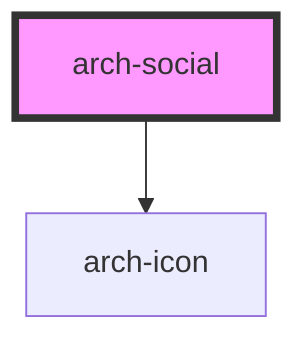

# arch-social

<!-- Auto Generated Below -->

## Properties

| Property   | Attribute   | Description | Type      | Default     |
| ---------- | ----------- | ----------- | --------- | ----------- |
| `insights` | --          |             | `object`  | `undefined` |
| `networks` | `networks`  |             | `string`  | `undefined` |
| `withText` | `with-text` |             | `boolean` | `undefined` |

## Dependencies

### Depends on

- [arch-icon](../icon)

### Graph

----------------------------------------------

*Built with [StencilJS](https://stenciljs.com/)*
